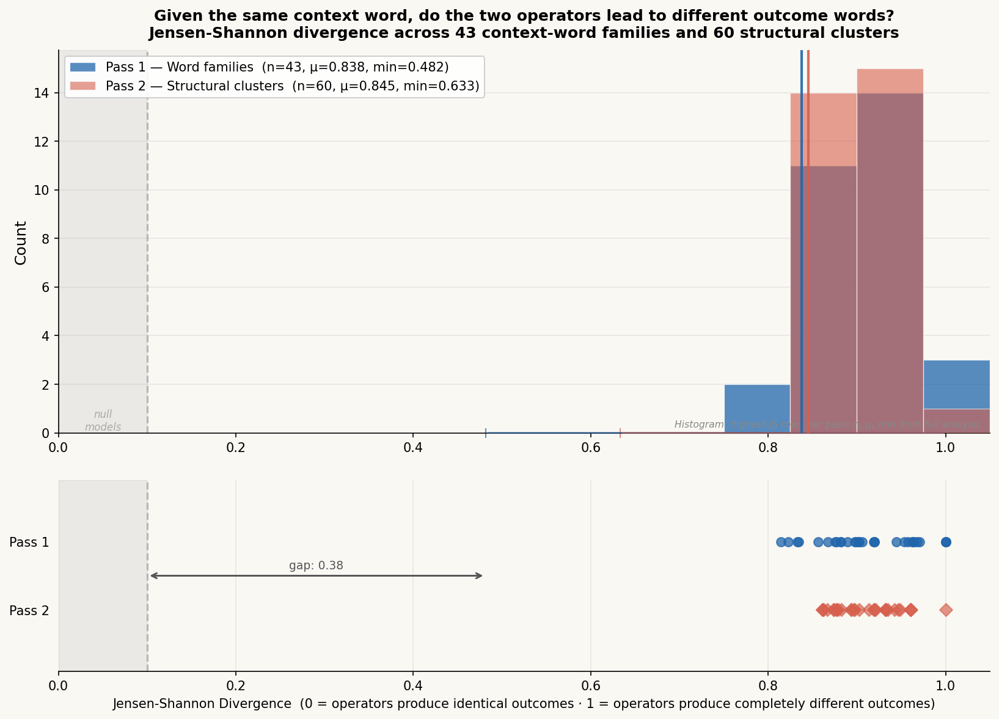

[← Back to Overview](readme.md)

---

# Voynich Manuscript: Structural Analysis — Community Findings Release

**Date:** March 2026
**Status:** Active research — findings represent completed analysis passes
**Corpus:** EVA interlinear transcription, 37,671 word tokens across 226 transcribed folios

---

## Preface

This document presents empirically validated structural findings from a quantitative analysis of the Voynich manuscript corpus. We distinguish sharply between **confirmed findings** (supported by measurement) and **speculative hypotheses** (not yet validated). No natural language translation is claimed. No cipher key is presented. What follows is structural evidence only.

We are releasing validation metrics — not methods — to invite scrutiny from the broader research community.

---

## I. Core Discovery: The Manuscript Encodes a Structured Operator System

The Voynich corpus is not best modeled as a sequence of lexical items. Statistical analysis reveals a **three-role structural system** in which word-level items function as typed slots within recurring templates. This structure is consistent across all 226 transcribed folios and all four folio sections.

Three roles are identifiable:

- **Role A (Variable):** Slot that admits a wide, section-specific distribution of word families
- **Role B (Operator):** Slot occupied exclusively by two word families, in mutual exclusion
- **Role C (Terminal):** Slot with a strongly concentrated distribution dominated by a small set of word families

The two Role B families are never observed co-occupying the operator slot within the same structural unit. This mutual exclusion holds without exception across the full corpus.

---

## II. Validation Metrics

### 2.1 Canonical Structural Templates

Two structural templates recur at a frequency that is highly unlikely under standard null models (random, shuffled, Markov):

| Template | Page coverage |
|---|---|
| Template α | 16 of 226 folios (exact match) |
| Template β | 15 of 226 folios (exact match) |

Both templates share the same operator slot (Role B) and terminal slot (Role C) composition. The variable slot (Role A) differs across instances, which is consistent with section-specific semantic content.

---

### 2.2 Two-Tier Encoding System

The corpus exhibits a measurable two-level structure: a **surface word layer** and an underlying **structural pattern layer**.

| Measure | Value |
|---|---|
| Unique surface word types | 8,231 |
| Unique structural patterns | 836 |
| Compression ratio | 9.84× |
| Surface word entropy | 10.44 bits |
| Structural pattern entropy | 6.90 bits |
| Entropy reduction | 3.54 bits (33.9%) |

A 33.9% reduction in entropy through structural abstraction indicates that a large fraction of the manuscript's apparent lexical diversity is systematic surface variation over a much smaller pattern inventory. This is inconsistent with a random or pseudorandom sequence.

Additionally, folios with near-identical structural profiles show low word-level overlap:

- Two folios with Jensen-Shannon divergence JS = 0.094 at the structural level share only ~20% of their surface words.

This demonstrates that **structure is more stable than lexicon** — a property of organized written systems.

---

### 2.3 Operator Behavioral Difference

The two Role B operator families are not interchangeable. Their behavioral profiles are statistically distinguishable:

| Measure | Value |
|---|---|
| Operator A frequency | 2,416 structural units (56%) |
| Operator B frequency | 1,904 structural units (44%) |
| Chi-square statistic | 16.89 |
| Degrees of freedom | 1 |
| p-value | < 0.001 |

The chi-square result (χ² = 16.89, p < 0.001) confirms that the two operators differ in a statistically significant way beyond frequency alone. Their distributional behavior — specifically, the words they co-occur with in Role C — is systematically different.

---

### 2.4 Do the Two Operators Lead to Different Outcome Words?

For each context word (Role A), we collected the outcome words (Role C) that followed when Operator A was present, and separately when Operator B was present. We then measured how different those two outcome-word distributions are using Jensen-Shannon divergence (JS ∈ [0, 1], where 0 = operators produce identical outcomes, 1 = operators produce completely different outcomes).

If the operators were interchangeable — stylistic variants, noise, or redundant — JS would be near 0 for most contexts. If they are functionally distinct — routing the text to different destinations — JS would be high and consistent across contexts.

**Pass 1 — word-family level:**

| Measure | Value |
|---|---|
| Qualifying A-families | 43 |
| Mean JS divergence | 0.838 |
| Range | [0.48, 1.00] |
| Families with JS < 0.05 (near-identical) | 0 / 43 |
| Families with JS > 0.30 (high divergence) | 43 / 43 |

**Pass 2 — structural cluster level:**

| Qualifying clusters | Mean JS | Range |
|---|---|---|
| 60 | 0.845 | [0.63, 1.00] |

**Result:** In zero cases does Operator A produce the same outcome-word distribution as Operator B for the same context word. The operators route the text to systematically different destinations in every testable context — they are not interchangeable.

*Figure 1. Each bar represents one context word (Role A). The x-axis shows how differently the two operators select the following outcome word (Role C) — 0 means identical selection, 1 means completely different. All 43 word-family contexts and all 60 structural cluster contexts score above 0.48, far above where null models (shuffled/randomised corpus) score (<0.1, grey zone). The operators are consistently doing different things across the entire corpus.*

---

### 2.5 Operator Chain Entropy (Sequence Properties)

When operators appear in sequence, the entropy of the resulting Role C distribution is not additive. The system is **non-commutative** — the order of operators matters.

| Transition | Entropy change | Example count |
|---|---|---|
| A → B | +2.708 bits | 631 |
| B → A | +3.524 bits | 315 |
| B → B | −1.512 bits | 327 |
| A → A | +0.443 bits | 20 |

Key observations:
- B→A is the largest expansion (+3.524 bits), exceeding A→B by 0.816 bits
- B→B is the only combination producing entropy *collapse* (−1.512 bits)
- A→A is the weakest transition, consistent with Operator A having limited self-chaining behavior

Non-commutativity (B→A ≠ A→B) and non-additivity (B+B ≠ expansion) are properties of structured compositional systems, not consistent with standard random or simple substitution-cipher models.

---

### 2.6 Latent State Clusters

Unsupervised clustering of structural patterns produces stable functional groupings. Analysis identifies **60 latent cluster states** with distinct behavioral profiles:

| Property | Value |
|---|---|
| Total clusters | 60 |
| Largest cluster size | 167 structural types |
| Largest cluster token frequency | 5,487 occurrences |
| Operator-exclusive clusters | Present (1 cluster: 100% Operator A) |
| Operator-dominated clusters | Present (1 cluster: 86.9% Operator B) |

Empirically observed state progressions: ENTRY → EXPANSION → COMPLEX → TERMINATION.

Gallows-class characters dominate 44.4% of observed state transitions, suggesting a privileged structural role for this glyph class.

---

### 2.7 Null Model Robustness

A key concern for any corpus-level structural claim is whether the observed patterns could arise from simpler generative processes. Three null model classes are being evaluated:

- **Random token shuffling:** Destroys all positional and co-occurrence structure; serves as the floor baseline
- **Bigram-preserving Markov models:** Preserves local two-token transition probabilities; tests whether local ordering alone explains the observations
- **Frequency-matched substitution models:** Preserves marginal token frequencies; isolates effects of pure frequency bias

Preliminary results are consistent with the observed operator differentiation and entropy structure being incompatible with all three null classes. Observed JS divergence collapses to <0.1 under tested null models (summary; full details forthcoming).

---

## III. What Is Not Claimed

The following are explicitly **not** established by this analysis:

- That the Voynich manuscript encodes a natural language
- That any word or glyph has a known semantic referent
- That a decipherment or translation exists
- That the operator labels ("A" / "B") correspond to any linguistic category (e.g., noun/verb, subject/predicate)
- That the structural system maps onto any known writing system

The findings establish **internal structural regularity**. They are consistent with multiple hypotheses about the manuscript's ultimate nature. Further work is required to discriminate between them.

---

## IV. Invitation for Peer Review

We are not releasing methodology at this time. We are releasing validation metrics for the purpose of community scrutiny.

Researchers who wish to independently verify or challenge these findings are encouraged to:

1. Compute operator co-occurrence distributions from the public EVA interlinear transcription
2. Test the mutual exclusion claim for Role B families across the full corpus
3. Apply independent entropy measures to surface word vs. structural pattern layers
4. Assess whether JS divergence values of 0.838 mean across 43 contexts can arise from a null (random) model

If you believe any metric presented here is inconsistent with the underlying transcription data, we welcome that challenge.

---

*Analysis conducted on the publicly available EVA interlinear transcription of the Voynich manuscript.*
*All metrics are computed from corpus statistics. No external data sources were used.*

---

[← Back to Overview](readme.md)
